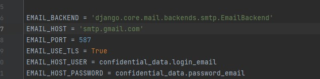

# Rental
Rental django-project for University subject. An internet application for renting books,
movies, and music CDs online. It allows browsing through catalogs, renting available
items, making payments, viewing statistics, making returns, and managing user accounts.
In addition, the functionality of automatic e-mails and checking return dates using celery
and redis. It was written based on django class-based-view, postgresql, celery, redis,
django-polymorphic.

# Requirements
amqp==5.1.1  
asgiref==3.6.0  
async-timeout==4.0.2  
billiard==3.6.4.0  
celery==5.2.7  
click==8.1.3  
click-didyoumean==0.3.0  
click-plugins==1.1.1  
click-repl==0.2.0  
colorama==0.4.6  
Django==4.1.5  
django-compat==1.0.15  
django-messages==0.6.0  
django-polymorphic==3.1.0  
django-redis==5.2.0  
kombu==5.2.4  
Pillow==9.4.0  
prompt-toolkit==3.0.36  
psycopg2==2.9.5  
py==1.11.0  
pytz==2022.7.1  
redis==4.5.1  
six==1.16.0  
sqlparse==0.4.3  
tzdata==2022.7  
vine==5.0.0  
wcwidth==0.2.6  

# Installation
**Clone repository**:  
_git clone https://github.com/ktylzanowski/rental.git_  

**Go to the project directory**:    
_cd rental_

**Create and activate a virtual environment**:    
_python3 -m venv venv_  
_source venv/bin/activate_

**Install the required Python packages**  
_pip install -r requirements.txt_  

**Connect your email to handle automated emails in the settings.py**  

_Enter Email and password. If it was a different email than gmail you would also need to change the EMAIL_HOST_  

  

**Create a PostgreSQL database and set the appropriate parameters in the file rental/settings.py**  

  

Enter the name, login and password for the database.  

**Perform database migration**:  
_python manage.py migrate_

**Start a Django server**:  
_python manage.py runserver_  

**Install and fire up Redis, depending on your system the installation may vary.**
**After firing in the renal directory, type the command**  
_celery -A rental worker -l info_

**Open a web browser and go to the address http://localhost:8000**

## Functionality Description
1. Implement a user authentication system that allows users to register and log in to the website. Additionally, allow users to modify their personal information.
2. Catalog browsing: Allow both logged-in and non-logged-in users to browse catalogs of books, movies and CDs. Catalogs are divided into categories and specific genres to make it easier for users to find what they are looking for.
3. Product view: Provide users with the ability to view individual products in detail, including images, descriptions, etc.

4. Use django polymorphic and have implemented model validations
5. Cart functionality: Allow logged-in users to add products to the shopping cart and proceed to checkout and pay via PayPal api. Use user sessions

6. Allows users to view their order history and track the status of their current orders. Users can also view an archive of their past orders and a list of all payments made. Additionally, enables users to return a product.
7. To facilitate automated order processing, I have integrated Redis and Django-Celery. This allows the system to check if the time for returning items has been exceeded and, if so, automatically imposes a debit on the user's account and sends an appropriate email notification.

8. User can view rental statistics and filter them over different time periods.

9. The django admin-panel was used to administer.

10. Automatic e-mails.
11. Tests are not fully finished.
# Technologies
Python 3.9  
Django 4.1  
HTML  
CSS  
JavaScript  
PostgreSQL  
Celery  
Redis  

# Author
Kacper Tylzanowski

# License
This project is licensed under the MIT License.